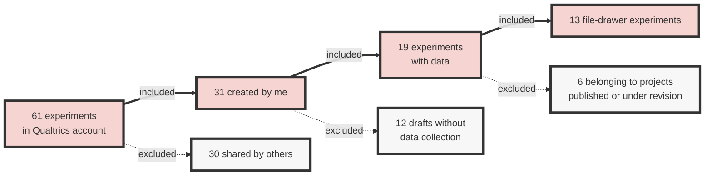





Hi, and welcome to My File Drawer! Here, you will find all 13 experiments I ran through my Stanford Qualtrics account.

The phrase file-drawer problem was first coined by a distinguished psychologist several decades ago (Rosenthal, 1979)

Here's a quick overview of how I got to 13 experiments in total:

## File drawer overview




